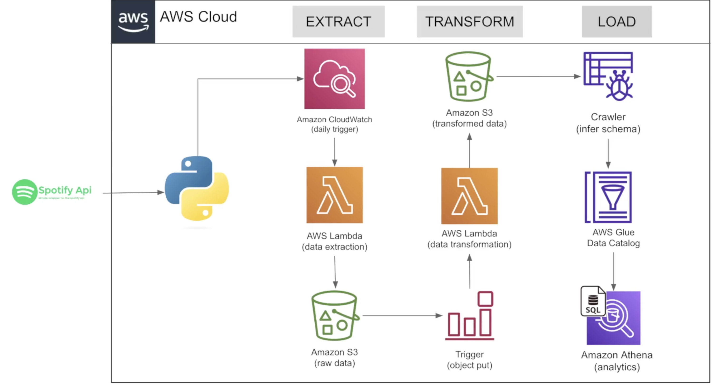

# Scope 

Extract top 50 global songs from spotify api weekly and feed downstream Business intelligence tool

# Data Architecture

# Resources Used 

## Working with Spotify API

Step 1: Log on to [Spotify developer console](https://developer.spotify.com/)

Step 2: Create an app to interact with the API

Step 3: Obtain the client secret and client id associate with the app and store data in the configuration file

Step 4: Import spotipy python package to interact with the api

Note - Make sure you rotate client secret for the app as scheduled maintenance

## Amazon S3 (Simple Storage Service)
This is a highly scalable object storage service used to store structured and un-structured data
AWS Bucket Name : arn:aws:s3:::spotify-etl-pipeline-nk
AWS Bucket Details : [s3://spotify-etl-pipeline-nk](https://us-east-1.console.aws.amazon.com/s3/buckets/spotify-etl-pipeline-nk?region=us-east-1&bucketType=general&prefix=transformed_data/album_data/album_transformed/&showversions=false)
AWS Bucket Type : General Purpose
AWS Bucket Folders : 
1. Raw 
   - to_processed 
   - processed
2. Transformed 
    - Album 
    - Artist
    - Songs

## Amazon Lambda

This is a serverless computing service used to execute code in response to events like when file gets added to a S3 bucket

AWS Lambda Functions:

[spotify_data_extract](https://us-east-1.console.aws.amazon.com/lambda/home?region=us-east-1#/functions/spotify_data_extract?tab=code)
- This function extracts raw spotify data as json, dumps it into to_processed folder in a S3 bucket
- Trigger : [EventBridge(CloudWatch Events):everyday](https://us-east-1.console.aws.amazon.com/events/home?region=us-east-1#/eventbus/default/rules/every_day)

[spotify_transformation_load_function](https://us-east-1.console.aws.amazon.com/lambda/home?region=us-east-1#/functions/spotify_transformation_load_function?tab=code)
- This function reads data from the to_processed folder of the S3 bucket,transforms data into album,artist and songs data models and pushes data into transformed folder of the S3 bucket. As an additional step once data has been transformed data is moved from to_processed to processed folder and to_processed folder is deleted(to avoid re-processing of data)
- Trigger : S3 event trigger when file is added to the to_processed folder

Note - Spotipy and Pandas packages might not be natively installed on lambda instance. We would need to add layers(zip file that contains library dependencies,custom runtime/configuration files).Pandas is provisioned by AWS as AWS layers but we would need to add a custom layer for Spotipy package 

## Amazon Cloud Watch 

This is a monitoring service used to collect and track metrics and log files. It can also be used to set alarms as well 
[EventBridge(CloudWatch Events):everyday](https://us-east-1.console.aws.amazon.com/events/home?region=us-east-1#/eventbus/default/rules/every_day)

Rule: 
Name : every_day
Event Schedule : 1 day or rate(1 days)
Description: Acts as a cloud scheduler to trigger spotify_data_extract lambda functions

## AWS Glue Crawler

Fully managed service used to crawl data sources and identify data formats and infer schema. This feeds into Aamzon Glue Data Catalog

[spotify_album_crawler](https://us-east-1.console.aws.amazon.com/glue/home?region=us-east-1#/v2/data-catalog/crawlers/view/spotify_album_crawler)

[spotify_artist](https://us-east-1.console.aws.amazon.com/glue/home?region=us-east-1#/v2/data-catalog/crawlers/view/spotify_artist)

[spotify_songs_crawler](https://us-east-1.console.aws.amazon.com/glue/home?region=us-east-1#/v2/data-catalog/crawlers/view/spotify_songs_crawler)

## Amazon Glue Data Catalog

Fully managed metadata repository

We are using Glue to crawl the transformed album,artist and songs datasets in the S3 bucket, and push the output in a defined database which can be referenced by Amazon Athena

### Steps to setup crawler 
1. Choose a custom name -> select the datasource(If S3, provide parent folder path ex.transformed/songs_data rather then transformed/songs_data/songs_transformed)

2. Create a general IAM role which has access to all folders of the S3 bucket or there is an option to create a new role which specific access to a folder in the S3 bucket 

3. Choose or create a database -> set schedule (on demand,custom,daily,weekly)

4. Create crawler 

### Note - 
1. Make sure there are no multiple files in the S3 bucket  before executing the crawler 

2. In some situations crawler can't identify column names and appears as col1,col2 on the created database table.To correct this click on the table -> edit shema as json -> make changes-> Actions-> Edit table-> Table properties add -> skip.header.line.count = 1

## Amazon Athena

Interactive query service that makes it easy to analyze data in Amazon S3 using standard SQL. We can use Athena to analyze data in Glue Data Catalog or other S3 buckets

We reference the database created in Glue Data Catalog to query data

[Amazon-Athena-Editor](https://us-east-1.console.aws.amazon.com/athena/home?region=us-east-1#/query-editor)

